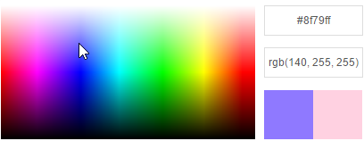

# ColorPickerPalette
ColorPickerPalette is a React reusable color picker palette written in ES6.

### Features
- Color picking from the palette.
- Live color preview.
- Remember  last color selected.
- Easy to use and install.

---

### Great! So how do I use it?
- Add a reference ColorPickerPalette.js in your React application: `import ColorPickerPalette from './react-colorpicker-palette/ColorPickerPalette.jsx'`.
- Initiate the color picker in your `render()` function: `<ColorPickerPalette id='yourPicker'/>`.

### How do I run the examples?
- First install all dependencies folder using: `npm install`.
- Now runs your local server: `npm start`.
- Run the examples: `gulp examples`.

---

### Customization
You can customize the defaults layout for the entire componenet using CSS.
The default style is visible at [ColorPickerPalette.css](ColorPickerPalette.css)

